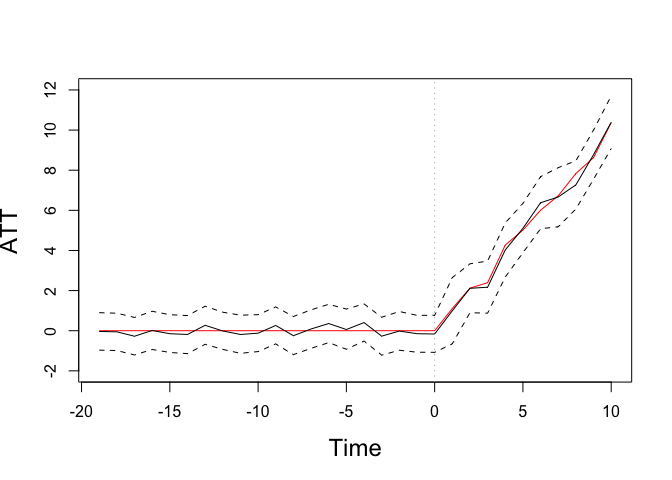
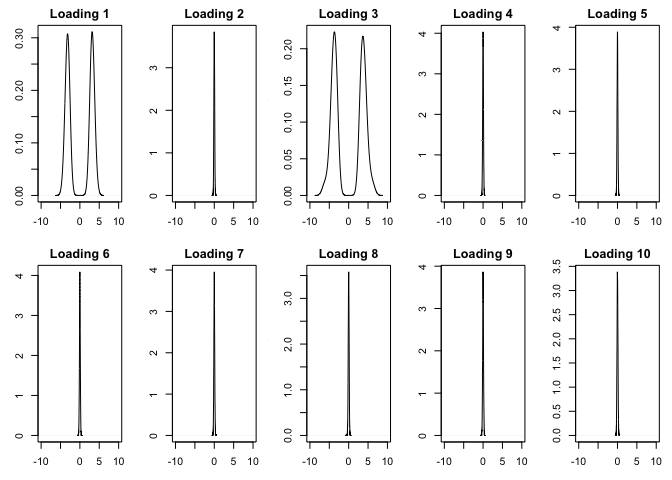

bpCausal: Bayesian Causal Inference with Time-Series Cross-Sectional
Data
================

**R** package for `A Bayesain Alternative to the Synthetic Control
Method`.

-----

**Authors:** Xun Pang (Tsinghua); Licheng Liu (MIT); Yiqing Xu
(Stanford).

**Date:** Mar. 27, 2021

**Package:** bpCausal

**Version:** 0.0.1 (GitHub version). This package is still under
development. Please report bugs\!

-----

## Contents

1.  Installation

2.  Instructions

3.  Example

-----

## Installation

The development version of the package can be installed from GitHub by
typing the following commands:

``` r
install.packages('devtools', repos = 'http://cran.us.r-project.org') # if not already installed
devtools::install_github('liulch/bpCausal')
```

The core part of **bpcausal** is written in C++ to accelerate the
computing speed, which depends on the packages **Rcpp** and
**RcppArmadillo**. Pleases install them before running the functions in
**bpCausal**.

#### Notes on installation failures

1.  For Rcpp, RcppArmadillo and MacOS “-lgfortran” and “-lquadmath”
    error, click
    [here](http://thecoatlessprofessor.com/programming/rcpp-rcpparmadillo-and-os-x-mavericks-lgfortran-and-lquadmath-error/)
    for details.
2.  Installation failure related to OpenMP on MacOS, click
    [here](http://thecoatlessprofessor.com/programming/openmp-in-r-on-os-x/)
    for a solution.
3.  To fix these issues, try installing gfortran 6.1 from
    [here](https://gcc.gnu.org/wiki/GFortranBinaries#MacOS%20clang4%20R%20Binaries%20from%20https://github.com/coatless/r-macos-clang).
4.  Clang error for Mac os Big Sur, you need to update Xcode, Xcode
    commandLine, and Clang.

-----

## Instructions

### Functional form

We begin with the description of the model to illustrate the syntax of
the function `bpCausal()`. `bpCausal()` can be implemented to estimate
an linear model with the following (reduced) functional form:

```math
y_{it} = \delta_{it} D_{it} + X_{it}^{\prime}\beta + Z_{it}^{\prime}\alpha_i 
+ A_{it}^{\prime}\Xi_t + \Gamma_i^{\prime}f_t + \varepsilon_{it}
```

where \(D_{it}\) is a binary treatment indicator and \(delta_{it}\)
represents heterogeneous treatment effect. \(X_{it}\), \(Z_{it}\) and
\(A_{it}\) are vectors of covariates that have constant, unit-level
random and time-level random effects on the outcome, respectively. The
random effects are assumed to have zero mean. Note that there can be
overlapping among \(X_{it}\), \(Z_{it}\) and \(A_{it}\) if some
covarites have both constant and random effects.

## Example

We use the built-in dataset, `simdata`, to illustrate the functionality
of `bpCausal()`. This is a balanced panel data that contains 50 units,
and the length of time periods is 30. Among the units, 5 are exposed to
the treatment from period 21 while the remaining 25 units are never
exposed to the treatment. Suppose we have 9 observed time-varying
covariates, `x1` to `x9`. In the true data generating process, there are
two latent factors, and the error term is sampled from i.i.d N(0, 1). We
first load the data.

``` r
set.seed(1234)
library(bpCausal) 
data(bpCausal)
ls()
```

    ## [1] "simdata"

We implement the function `bpCausal()` to fit an linear model above with
random effects at unit and (or) time level and latent factors. The
`data` option specifies the dataset, which is a data frame object, the
`index` option specifies the name of the unit and time index, and
`Yname`, `Dname`, `Xname`, `Zname` and `Aname` specifies the names of
the outcome variable, treatment indicator, and covariates respectively.
Option `re` specifies the inclusion of two-way random effects. `ar1` is
a logical flag indicating  
whether the factors (and the time-level random effects) follow ar1
process. `r` specifies the (upper bound of) number of factors. `Niter`
is the number of MCMC draws and `burn` is the length of burn-in chains
for MCMC simulations. `xlasso`, `zlasso`, `alasso` and `flasso` specify
whether to shrink constant effects, unit or time level random effects,
and factor loadings for factor selection, respectively. The other
parameters are hyper parameters for the Gamma priors, and the default
values ensure the priors are diffusive. For detailed explanation of the
options, please refer to the help manual.

``` r
## with factors
out1 <- bpCausal(data = simdata, ## simulated dataset  
                 index = c("id", "time"), ## names for unit and time index
                 Yname = "Y", ## outcome variable
                 Dname = "D", ## treatment indicator  
                 Xname = c("X1", "X2", "X3", "X4", "X5", "X6", "X7", "X8", "X9"), # covariates that have constant (fixed) effect  
                 Zname = c("X1", "X2", "X3", "X4", "X5", "X6", "X7", "X8", "X9"), # covariates that have unit-level random effect  
                 Aname = c("X1", "X2", "X3", "X4", "X5", "X6", "X7", "X8", "X9"), # covariates that have time-level random effect  
                 re = "both",   # two-way random effect: choose from ("unit", "time", "none", "both") 
                 ar1 = TRUE,    # whether the time-level random effects is ar1 process or jsut multilevel (independent)
                 r = 10,        # factor numbers 
                 niter = 15000, # number of mcmc draws
                 burn = 5000,   # burn-in draws 
                 xlasso = 1,    ## whether to shrink constant coefs (1 = TRUE, 0 = FALSE)
                 zlasso = 1,    ## whether to shrink unit-level random coefs (1 = TRUE, 0 = FALSE)
                 alasso = 1,    ## whether to shrink time-level coefs (1 = TRUE, 0 = FALSE)
                 flasso = 1,    ## whether to shrink factor loadings (1 = TRUE, 0 = FALSE)
                 a1 = 0.001, a2 = 0.001, ## parameters for hyper prior shrink on beta (diffuse hyper priors)
                 b1 = 0.001, b2 = 0.001, ## parameters for hyper prior shrink on alpha_i
                 c1 = 0.001, c2 = 0.001, ## parameters for hyper prior shrink on xi_t
                 p1 = 0.001, p2 = 0.001) ## parameters for hyper prior shrink on factor terms
```

The `bpCausal` package have two functions to summarize the posteriors.
`coefSummary()` can be used to obtain summary statistics for posteriors
of relevant parameters and `effSummary()` summaries the semi-parametric
distribution of treatment effect, which is the difference between
observed outcome under treatment and its corresponding posterior
predictive distribution of the counterfactual outcomes. Options for
individual level treatment effects and cumulative effects are also
provided.

``` r
sout1 <- coefSummary(out1)  ## summary estimated parameters
eout1 <- effSummary(out1,   ## summary treatment effects
                    usr.id = NULL, ## treatment effect for individual treated units, if input NULL, calculate average TT
                    cumu = FALSE,  ## whether to calculate culmulative treatment effects
                    rela.period = TRUE) ## whether to use time relative to the occurence of treatment (1 is the first post-treatment period) or real period (like year 1998, 1999, ...)
```

We show the summary statistics for the posterior distributions of
constant effects, where the first row is the intercept, and the
by-period average treatment effect on the treated :

``` r
sout1$est.beta 
```

    ##            mean        ci_l       ci_u
    ## 1   3.216342541  2.31551825 4.35245165
    ## 2   5.443495486  3.98143551 7.29012995
    ## 3   4.528195378  3.71392133 5.25068726
    ## 4   2.135290790  1.68224017 2.57018813
    ## 5   0.017610650 -0.05387187 0.08924420
    ## 6   0.027980777 -0.04937649 0.10773005
    ## 7   0.018670242 -0.06004240 0.10000826
    ## 8   0.024584419 -0.05036327 0.09786939
    ## 9  -0.002792049 -0.07838290 0.07074836
    ## 10  0.011068277 -0.05710119 0.08236792

``` r
eout1$est.eff
```

    ##        observed estimated_counterfactual counterfactual_ci_l
    ## -19   4.1630208                4.2003779          5.13108637
    ## -18  -1.0615871               -1.0052199         -0.07433368
    ## -17   1.4824104                1.7569435          2.69185251
    ## -16  -3.3812484               -3.3934697         -2.44763639
    ## -15  -2.0052712               -1.8557286         -0.92219530
    ## -14  -9.1490261               -8.9624305         -8.00699540
    ## -13 -13.6507511              -13.9213580        -12.97419077
    ## -12 -15.0588746              -15.0457484        -14.12852064
    ## -11 -14.3987819              -14.2111608        -13.27216196
    ## -10  -0.3367976               -0.2142631          0.70244213
    ## -9   -4.4427223               -4.7048990         -3.78444691
    ## -8  -12.4645038              -12.2164166        -11.27132465
    ## -7   13.4435331               13.3563473         14.32030402
    ## -6   15.9935776               15.6356406         16.58789778
    ## -5   23.8552090               23.7959203         24.77797271
    ## -4    9.7736350                9.3683315         10.29018203
    ## -3   16.8532450               17.1236349         18.06984411
    ## -2   18.7308320               18.7471839         19.70409326
    ## -1   11.5749549               11.7229043         12.64624241
    ## 0     4.5991245                4.7641679          5.67728604
    ## 1    12.5940358               11.5988582         13.24438082
    ## 2     6.9063234                4.7925062          6.00862718
    ## 3    -5.6727662               -7.8416581         -6.54732143
    ## 4     1.1575969               -2.8684886         -1.51714751
    ## 5     1.7247383               -3.3808469         -2.16337180
    ## 6    14.2612847                7.8837915          9.17906911
    ## 7    14.9896892                8.3226507          9.80742533
    ## 8    23.6636602               16.3939746         17.59680997
    ## 9    22.6690251               13.8950602         15.11727134
    ## 10   26.2420677               15.8521999         17.16001788
    ##     counterfactual_ci_u estimated_ATT estimated_ATT_ci_l estimated_ATT_ci_u
    ## -19           3.2629874   -0.03735716         -0.9680656          0.9000333
    ## -18          -1.9338517   -0.05636719         -0.9872534          0.8722646
    ## -17           0.8203107   -0.27453311         -1.2094421          0.6620997
    ## -16          -4.3510947    0.01222134         -0.9336120          0.9698464
    ## -15          -2.8032306   -0.14954264         -1.0830759          0.7979594
    ## -14          -9.9053394   -0.18659563         -1.1420307          0.7563132
    ## -13         -14.8707930    0.27060689         -0.6765604          1.2200419
    ## -12         -15.9818399   -0.01312614         -0.9303539          0.9229653
    ## -11         -15.1738327   -0.18762108         -1.1266200          0.7750507
    ## -10          -1.1369334   -0.12253448         -1.0392397          0.8001358
    ## -9           -5.6278025    0.26217670         -0.6582754          1.1850803
    ## -8          -13.1730970   -0.24808716         -1.1931791          0.7085933
    ## -7           12.4031749    0.08718583         -0.8767709          1.0403583
    ## -6           14.6767726    0.35793699         -0.5943202          1.3168050
    ## -5           22.7746047    0.05928877         -0.9227637          1.0806044
    ## -4            8.4364122    0.40530350         -0.5165470          1.3372228
    ## -3           16.1816750   -0.27038989         -1.2165991          0.6715700
    ## -2           17.7735816   -0.01635189         -0.9732612          0.9572504
    ## -1           10.8082986   -0.14794935         -1.0712875          0.7666563
    ## 0             3.8314721   -0.16504344         -1.0781615          0.7676524
    ## 1             9.9456049    0.99517757         -0.6503450          2.6484309
    ## 2             3.5721622    2.11381721          0.8976962          3.3341612
    ## 3            -9.1438161    2.16889186          0.8745552          3.4710499
    ## 4            -4.2175370    4.02608550          2.6747444          5.3751339
    ## 5            -4.6203528    5.10558520          3.8881101          6.3450911
    ## 6             6.5847366    6.37749321          5.0822156          7.6765481
    ## 7             6.8636136    6.66703857          5.1822639          8.1260756
    ## 8            15.1934748    7.26968570          6.0668503          8.4701855
    ## 9            12.6704044    8.77396485          7.5517537          9.9986206
    ## 10           14.5389968   10.38986783          9.0820498         11.7030709
    ##     time count
    ## -19  -19     7
    ## -18  -18     7
    ## -17  -17     7
    ## -16  -16     7
    ## -15  -15     7
    ## -14  -14     7
    ## -13  -13     7
    ## -12  -12     7
    ## -11  -11     7
    ## -10  -10     7
    ## -9    -9     7
    ## -8    -8     7
    ## -7    -7     7
    ## -6    -6     7
    ## -5    -5     7
    ## -4    -4     7
    ## -3    -3     7
    ## -2    -2     7
    ## -1    -1     7
    ## 0      0     7
    ## 1      1     7
    ## 2      2     7
    ## 3      3     7
    ## 4      4     7
    ## 5      5     7
    ## 6      6     7
    ## 7      7     7
    ## 8      8     7
    ## 9      9     7
    ## 10    10     7

The following figure gives a graphical comparison between the true and
estimated ATTs. The red line is the true ATT, the solid black line is
the posterior mean, and the dashed lines indicate the 95 % posterior
credible intervals. We find that the posterior means are very close to
the true values.

``` r
x1 = c(-19:10)
y1 <- apply(matrix(simdata[which(simdata$treat==1),"eff"], 30, 5), 1, mean)

plot(x1, y1, type = "l", col = "red", ylim = c(-2, 12), 
    xlab = "Time", ylab = "ATT", cex.lab = 1.5)
abline(v = 0, lty = 3, col = "grey")
lines(x1, eout1$est.eff$estimated_ATT)
lines(x1, eout1$est.eff$estimated_ATT_ci_l, lty = 2)
lines(x1, eout1$est.eff$estimated_ATT_ci_u, lty = 2)
```

<!-- -->

Finally, we show the results for factor number selection. The following
figures are the posterior distribution of the square root of prior
variance for each factor loading. If the posterior is spiked at zero, we
are confident that we can remove the corresponding factor. If the
posterior is bimodal, we are confident that there is variation among
factor loadings, so the corresponding factor should be included to
control for unobserved heterogeneity. The following figures indicate that 
we need to include 2 factors in the model, which is consistent with the 
true DGP.

``` r
xlim = c(-10,10)
dim(out1$gamma)
```

    ## [1]    50    10 10000

``` r
wg <- out1$wg
par(mfrow = c(2, 5), mar = c(3,3,2,1))
for (i in 1:10) {
    plot(density(wg[i,]), xlim = xlim, main = paste0("Loading ",i))
}
```

<!-- -->

-----

### Important Notes

-----

**Addtional References:**

\(\square\)
